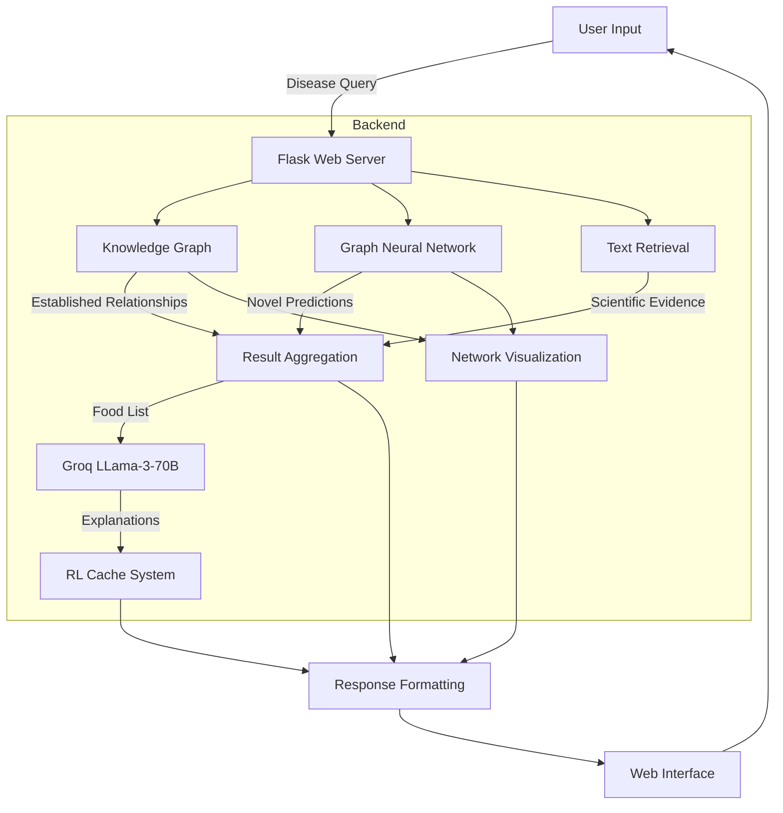

# Report-To-Plate: Personalized Nutrition Recommendation System

## System Architecture

## Overview

Report-To-Plate is an advanced nutrition recommendation system that leverages multiple AI technologies to suggest foods beneficial for specific health conditions. The system combines knowledge graphs, graph neural networks, text retrieval, and natural language processing to provide evidence-based nutritional recommendations with scientific explanations.

## Core Components

### 1. Knowledge Graph (KG) System

The knowledge graph represents structured relationships between foods and diseases:

- **Purpose**: Provides established, evidence-backed food-disease relationships
- **Data**: Includes food entities, disease entities, and the relationships between them
- **Functions**: 
  - Maps foods to their nutritional composition
  - Stores evidence links for each relationship
  - Enables structured querying of established relationships

The KG component delivers recommendations based on explicitly documented relationships in medical literature and nutritional science.

### 2. Graph Neural Network (GNN) Model

The GNN learns patterns from the knowledge graph to predict novel food-disease relationships:

- **Architecture**: Uses GCNConv layers to learn node embeddings and a link prediction layer
- **Training**: Learns from existing food-disease connections in the knowledge graph
- **Inference**: Predicts potential beneficial foods not explicitly documented in literature
- **Innovation**: Can discover non-obvious food recommendations based on structural patterns

This component enables NutriAI to go beyond manually curated knowledge and suggest foods that might be beneficial based on similarity to established patterns.

### 3. Text Retrieval System

The text retrieval component provides scientific evidence supporting recommendations:

- **Embedding Model**: Uses microsoft/BiomedNLP-PubMedBERT-base-uncased-abstract for domain-specific text encoding
- **Vector Database**: FAISS index for efficient similarity search
- **Function**: Retrieves relevant scientific literature that supports the food-disease relationships
- **Evidence Quality**: Ranks evidence by relevance score

This ensures all recommendations are backed by scientific literature, enhancing credibility and educational value.

### 4. LLM Integration (Groq API)

Report-To-Plate integrates with Groq's LLama-3-70B model for natural language explanations:

- **Purpose**: Generates concise, scientifically-grounded explanations of food-disease relationships
- **Prompt Engineering**: Structured to produce clear, factual explanations without unnecessary disclaimers
- **Output**: Provides a maximum 40-word explanation of why a specific food might benefit a condition

This component translates complex nutritional science into accessible explanations for users.

### 5. Reinforcement Learning Cache System

The RL cache system intelligently manages explanation caching:

- **Learning Mechanism**: Uses Q-learning to determine which queries to cache
- **State Representation**: Based on response time and cache fullness
- **Reward Function**: Logarithmic function of response time (favors caching slower responses)
- **Persistence**: Saves learning progress and cache between server restarts
- **Exploration vs. Exploitation**: Uses epsilon-greedy policy for decision making

This innovative approach optimizes system performance by learning from usage patterns.

### 6. Visualization Component

Network visualizations help users understand food-disease relationships:

- **Graph Generation**: Creates subgraphs of the knowledge graph centered on selected food-disease pairs
- **Visual Encoding**: Uses color coding to distinguish diseases and foods
- **Interactivity**: Users can request visualizations for specific recommendations
- **Educational Value**: Helps users understand the context of recommendations

### 7. Web Interface

A Flask-based web application serves as the user interface:

- **Input**: Disease selection from dropdown or manual entry
- **Results Display**: Organized presentation of recommendations with evidence
- **Interactivity**: On-demand explanations and visualizations
- **Admin Features**: Cache management interface

## System Pipeline Flow

1. **User Input Processing**:
   - User selects a health condition via the web interface
   - The query is normalized and processed for model compatibility

2. **Multi-Model Recommendation Generation**:
   - **KG Model**: Retrieves foods directly linked to the condition in the knowledge graph, along with nutritional data
   - **GNN Model**: Predicts additional foods likely to be beneficial based on learned patterns
   - Both sets of recommendations are aggregated for comprehensive coverage

3. **Evidence Collection**:
   - For each recommended food, supporting evidence is gathered:
     - Nutritional composition (macronutrients, micronutrients, calories)
     - Scientific literature excerpts from the text retrieval system
     - LLM-generated explanations of the food-disease relationship

4. **Explanation Generation**:
   - The system checks the RL cache for existing explanations
   - For cache misses, it queries the Groq API with the food-disease pair
   - The RL system decides whether to cache the new explanation based on response time
   - Cached responses improve future system performance

5. **Result Presentation**:
   - Recommendations are organized by source (KG vs. GNN)
   - Each food is presented with its nutritional profile and evidence
   - Users can request additional explanations or visualizations on demand

6. **Visualization On Request**:
   - When a user requests visualization, the system extracts a relevant subgraph
   - The visualization shows the selected food-disease relationship in context
   - The network graph is rendered and displayed in the interface

## Technical Implementation

### Backend Technologies

- **Web Framework**: Flask for server-side logic and API endpoints
- **ML Libraries**: PyTorch, PyTorch Geometric for GNN implementation
- **Vector Search**: FAISS for efficient similarity search in the text retrieval system
- **Embedding Models**: SentenceTransformer with biomedical pre-training
- **Graph Processing**: NetworkX for graph manipulation and visualization
- **LLM Integration**: Groq API client for accessing LLama-3-70B

### Data Processing Pipeline

- **Data Loading**: All models and data are loaded at server startup
- **Query Processing**: Input normalization and cleaning for consistent results
- **Response Formatting**: Structured aggregation of multi-model outputs
- **Caching Logic**: Reinforcement learning for optimization decisions

### Performance Optimizations

- **Intelligent Caching**: RL-based decisions on what to cache
- **Persistent Storage**: Cache and learning state preserved between sessions
- **Efficient Vector Search**: FAISS indexing for fast text retrieval
- **Batch Processing**: Parallel collection of recommendations from different models

## Use Cases

### For Individuals with Health Conditions

- **Dietary Guidance**: Evidence-based food recommendations for specific conditions
- **Educational Value**: Scientific explanations and visualizations improve understanding
- **Discovery**: Introduction to beneficial foods they may not have considered

### For Healthcare Providers

- **Clinical Support**: Evidence-backed dietary recommendations for patients
- **Patient Education**: Visual tools to explain nutritional concepts
- **Scientific Basis**: Access to relevant literature for deeper investigation

### For Nutritional Researchers

- **Knowledge Exploration**: Visualize and explore the food-disease knowledge network
- **Novel Connections**: Discover potential relationships predicted by the GNN
- **Literature Access**: Quickly access relevant research for specific food-disease pairs

## Conclusion

Report-To-Plate represents a sophisticated integration of knowledge graphs, machine learning, and natural language processing to create an evidence-based nutritional recommendation system. By combining structured knowledge with predictive capabilities and natural language explanations, it bridges the gap between complex nutritional science and practical dietary guidance.

The multi-modal approach—combining established knowledge (KG), pattern learning (GNN), and scientific literature (text retrieval)—provides robust recommendations with multiple lines of evidence. Meanwhile, the LLM integration and visualization capabilities make complex scientific information accessible to users without specialized knowledge.

The reinforcement learning caching system demonstrates an innovative approach to system optimization, learning from usage patterns to improve performance over time.

Overall, NutriAI offers a powerful tool for understanding the relationship between food and health, with potential applications in healthcare, personal wellness, and nutritional research.
